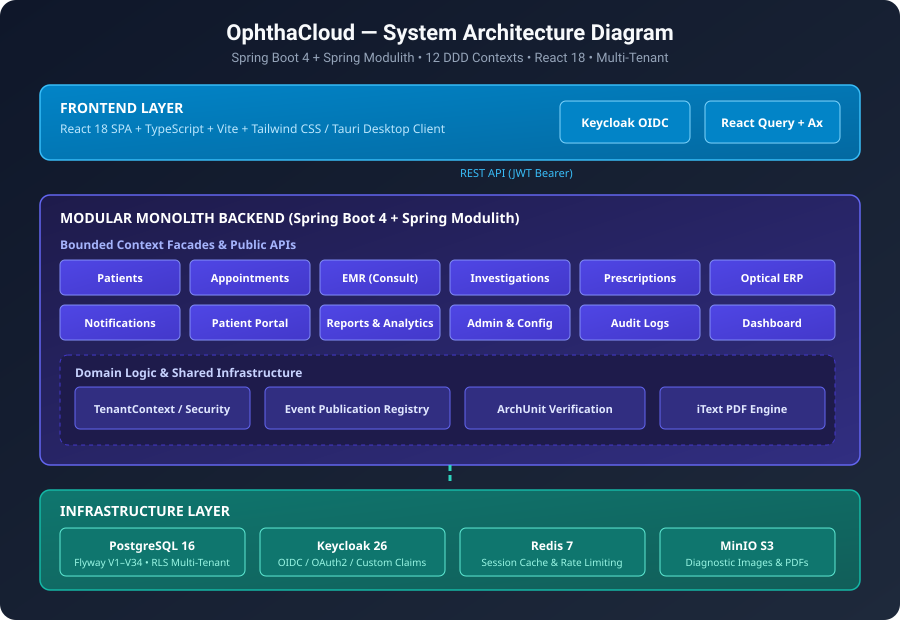
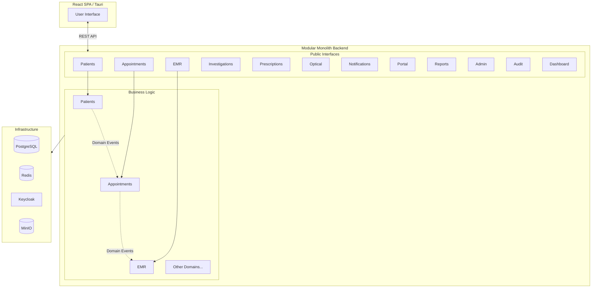
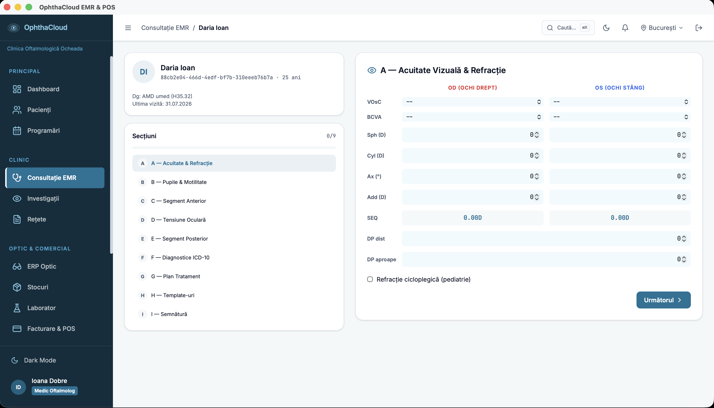

# OphthaCloud EMR/ERP


[](https://github.com/blank648/ophthacloud/actions/workflows/ci.yml)
[](https://github.com/blank648/ophthacloud/actions/workflows/ci.yml)


> Cloud-native Electronic Medical Record and ERP platform
> for ophthalmology clinics — built with Spring Boot 4 +
> Spring Modulith, React, multi-tenant, GDPR-compliant.

## Architecture



<details>
<summary>🔍 View Mermaid Diagram Source</summary>



</details>

## 🏗️ Architecture Highlights

- **Modular Monolith**: 12 DDD bounded contexts cu Spring Modulith, comunicare strict prin Facades și Domain Events
- **Architectural Governance**: ArchUnit validează automat izolarea modulelor la fiecare build
- **Multi-Tenancy**: Izolare la nivel de tenant din JWT claims Keycloak, propagat transparent prin TenantContext
- **Event-Driven**: Outbox pattern cu Spring Modulith Event Publication Registry în PostgreSQL
- **Enterprise Security**: OAuth2/OIDC via Keycloak 26, RBAC cu matrice granulară per modul/acțiune
- **Full-Stack**: React 18 + TypeScript SPA cu 28 pagini, 62 componente, Tauri desktop wrapper
- **Database Evolution**: 34 migrări Flyway versionare, schema multi-tenant

## Screenshots





---

## Project Overview

OphthaCloud is a full-stack, cloud-native system for ophthalmology clinics. It operates as a cohesive platform comprising a robust backend server and a responsive frontend web application. The platform is actively integrating a production-ready UI layer with the backend business services.

## Repository Structure

This monorepo contains two primary components:

### `./frontend` — Official Frontend (React)
Role: The official user interface and client application for OphthaCloud.
Built with React 18, TypeScript, Tailwind CSS, shadcn/ui, and Vite. This directory serves as the working UI foundation and interacts with the backend APIs to deliver features to users. 
Stack: React 18, TypeScript, Tailwind CSS, shadcn/ui, Vite, React Query, Zustand.
Status: Active integration phase. Formerly a prototype, it is now being adapted as the production UI, consuming backend services.

### `./backend` — Production Backend (Spring Boot)
Role: The REST API backend.
Implements all business logic, data persistence, security, and multi-tenancy.
Stack: Java 21, Spring Boot 4.0.5, Spring Modulith, PostgreSQL 16, Keycloak 26.
Status: Active development and integration target.

---

## Current Status & Implementation Complete

All 11 development sprints and 12 core business modules have been fully implemented, tested, and integrated across the full stack.
- **Backend:** 12 Spring Modulith bounded contexts (Patients, Appointments, EMR, Investigations, Prescriptions, Optical, Notifications, Portal, Reports, Admin, Audit, Dashboard) with multi-tenancy, JWT-based RBAC, and clean module facades.
- **Frontend:** React 18 + TypeScript SPA (28 pages, 62 components) consuming backend `/api/v1` REST APIs via `apiClient`, featuring `keycloak-js` authentication, Zustand state management, and Tauri desktop application wrapper.
- **Governance & Verification:** ArchUnit strict architecture enforcement, Flyway database evolution (V1–V34), and comprehensive automated unit and integration tests.

---

## Backend — Technical Overview

### Tech Stack

| Layer | Technology | Version |
|---|---|---|
| Language | Java | 21 |
| Framework | Spring Boot | 4.0.5 |
| Architecture | Spring Modulith | 2.0.0 |
| Database | PostgreSQL | 16 |
| Migrations | Flyway | latest |
| Cache | Redis | 7 |
| Security | Keycloak | 26 |
| Build | Maven | 3.9+ |
| Containerization | Docker + Compose | latest |

### Architecture

The backend uses Spring Modulith to enforce explicit module boundaries. Each business domain is an independent module with a public facade API. Cross-module communication happens exclusively through public facades and Spring application events — never via direct repository access.

Multi-tenancy is implemented at the data layer: every entity extends `TenantAwareEntity` and carries a `tenant_id` column. Tenant resolution is automatic via `TenantContext` propagated from the JWT on every request.

---

## Development Progress

### Completed Sprints (Sprints 1–11)

#### Sprint 1 — Infrastructure & Shared Foundation
- Spring Boot 4 + Spring Modulith project initialization
- Docker Compose setup (PostgreSQL 16, Redis 7, Keycloak 26, MinIO)
- Flyway baseline schema migrations (`V1`–`V7`)
- Shared API response wrappers (`ApiResponse`, `PagedApiResponse`)
- Global exception handling with structured error codes
- `TenantAwareEntity` base class & `AuditLog` module (`AuditLogService` + `AuditLogEntity`)

#### Sprint 2 — Security & Multi-Tenancy
- Keycloak OAuth2/OIDC JWT integration (`OphthaClinicalJwtConverter`)
- Custom PermissionEvaluator (`OphthaClinicalPermissionEvaluator`)
- Granular RBAC model: tenant × role × module × action (VIEW/CREATE/EDIT/DELETE/SIGN)
- Automatic `TenantContext` propagation from JWT claims
- Security utilities & full security test suite

#### Sprint 3 — Patients Module
- Patient schema migration (`V8__create_patients.sql`)
- `PatientEntity` (extends `TenantAwareEntity`) & `PatientManagementFacade`
- 9 REST endpoints (`PatientController`): listing, paginated search, CRUD, consultation & prescription history, portal invite
- Medical Record Number (MRN) auto-generation: `[CLINIC]-[YEAR]-[SEQ]`
- Event publication: `PatientCreatedEvent`

#### Sprint 4 — Appointments Module
- Appointment schema & PostgreSQL enum migrations (`V9`, `V10`)
- `AppointmentEntity`, `AppointmentTypeEntity`, `BlockedSlotEntity`
- `AppointmentManagementFacade` with anti-double-booking algorithm and status state machine
- Calendar query endpoints (range up to 31 days) & appointment type management
- Domain events: `AppointmentBookedEvent`, `AppointmentCompletedEvent`, `PatientCheckedInEvent`, `AppointmentStatusChangedEvent`

#### Sprint 5 — EMR (Electronic Medical Record) Module
- EMR schema migration (`V11__emr_module.sql`)
- `EmrFacade`, `ConsultationEntity`, `VisualAcuityEntity`, `IopMeasurementEntity`, `SlitLampEntity`, `FunduscopyEntity`
- Comprehensive ophthalmology examination records: Snellen/VOsC visual acuity, Goldmann Applanation Tonometry (IOP), anterior segment slit lamp & fundus examination
- ICD-10 diagnosis coding & clinical timeline history with `ConsultationFinalizedEvent`

#### Sprint 6 — Investigations & Prescriptions Modules
- Investigations schema & equipment migrations (`V12`, `V16`, `V26`)
- `InvestigationFacade` managing diagnostic orders (OCT, Visual Field/Perimetry, Corneal Topography, Fundus Photo) and DICOM metadata
- Prescriptions schema & enum fix migrations (`V13`, `V15`)
- `PrescriptionFacade` for ocular and systemic drug prescriptions, dosage/route guidelines, digital signature simulation, print layout data, and `PrescriptionIssuedEvent`

#### Sprint 7 — Optical Module
- Optical shop schema migration (`V18__optical_module.sql`)
- `OpticalFacade` for spectacle and contact lens refraction measurements (sphere, cylinder, axis, addition, pupillary distance)
- Optical frame and lens inventory management, order processing, and fulfillment tracking

#### Sprint 8 — Notifications Module
- Notifications schema, retry, settings & seed rules migrations (`V19`, `V20`, `V25`, `V28`, `V29`)
- `NotificationFacade` with multi-channel SMS and Email dispatch capabilities
- Automated appointment reminder triggers, configurable notification rules, and background retry queue mechanism

#### Sprint 9 — Patient Portal Module
- Patient Portal facade & `PatientPortalController`
- Secure patient access token authentication and magic link invitations
- Patient self-service appointment scheduling, consultation summary viewing, prescription history access, and medical document downloads

#### Sprint 10 — Admin, Reports & Analytics Modules
- System admin schema & permission fixes (`V21`, `V22`)
- `AdminFacade` for clinic staff user provisioning, role-permission matrix configuration, and equipment management
- `ReportsFacade` & `DashboardFacade` for financial revenue analytics, clinical KPI metrics, patient demographics, and CSV/PDF report exporting

#### Sprint 11 — Full-Stack Integration, Architectural Governance & Hardening
- Complete Flyway seed & cross-module relation migrations (`V23`–`V34`) including demo tenant, realistic test data, ICD-10 diagnoses, and RBAC matrix
- ArchUnit architectural governance suite (`OphthacloudArchitectureTests`) validating module isolation and zero cyclic dependencies
- Full React 18 + TypeScript UI integration (28 pages, 62 components) and Tauri desktop application bundle
- End-to-end multi-tenant validation, CI/CD automated workflow, and production readiness checks

---

### Module Status

| Module | Status | Migration | Facade | Controller | Tests |
|---|---|---|---|---|---|
| patients | ✅ Complete | V8 | ✅ | ✅ | ✅ |
| appointments | ✅ Complete | V9, V10 | ✅ | ✅ | ✅ |
| emr | ✅ Complete | V11 | ✅ | ✅ | ✅ |
| investigations | ✅ Complete | V12, V16, V26 | ✅ | ✅ | ✅ |
| prescriptions | ✅ Complete | V13, V15 | ✅ | ✅ | ✅ |
| optical | ✅ Complete | V18 | ✅ | ✅ | ✅ |
| notifications | ✅ Complete | V19, V20, V25, V28, V29 | ✅ | ✅ | ✅ |
| portal | ✅ Complete | — | ✅ | ✅ | ✅ |
| reports | ✅ Complete | V32 | ✅ | ✅ | ✅ |
| admin | ✅ Complete | V21, V22, V33, V34 | ✅ | ✅ | ✅ |
| audit | ✅ Complete | V2, V3, V14 | ✅ | ✅ | ✅ |
| dashboard | ✅ Complete | V32 | ✅ | ✅ | ✅ |

---

### Database Migrations

| Version | File | Description |
|---|---|---|
| V1 | V1__baseline_schema.sql | Baseline schema (tenants, clinics, staff) |
| V2 | V2__audit_log.sql | Audit log infrastructure |
| V3 | V3__rename_user_id_to_actor_id.sql | Schema cleanup (audit log) |
| V4 | V4__create_event_publication.sql | Spring Modulith event publication table |
| V5 | V5__fix_event_publication_complete.sql | Fix for event publication visibility |
| V6 | V6__add_event_publication_resubmission.sql | Event resubmission support |
| V7 | V7__add_event_publication_status.sql | Event status tracking |
| V8 | V8__create_patients.sql | Patients module schema |
| V9 | V9__create_appointments.sql | Appointments module schema |
| V10 | V10__fix_appointments_enum_types.sql | Fix for Appointment PostgreSQL enums |
| V11 | V11__emr_module.sql | EMR module schema (consultations, visual acuity, IOP, examination findings) |
| V12 | V12__investigations_module.sql | Diagnostic investigations & imaging orders schema |
| V13 | V13__prescriptions_module.sql | Ocular & systemic prescriptions schema |
| V14 | V14__fix_missing_audit_columns.sql | Audit columns fix across entities |
| V15 | V15__fix_prescription_enum_types.sql | PostgreSQL enum fix for prescriptions |
| V16 | V16__fix_investigations_enum_types.sql | PostgreSQL enum fix for investigations |
| V17 | V17__fix_patient_enum_types.sql | PostgreSQL enum fix for patients |
| V18 | V18__optical_module.sql | Optical shop, spectacle/contact lens & inventory schema |
| V19 | V19__notifications_module.sql | Notifications dispatcher & messaging schema |
| V20 | V20__add_notification_retry.sql | Retry mechanism for notification failures |
| V21 | V21__admin_module.sql | System administration & staff management schema |
| V22 | V22__fix_permissions_table.sql | RBAC permissions table schema fix |
| V23 | V23__cross_module_fks.sql | Cross-module foreign key relations |
| V24 | V24__seed_demo_tenant.sql | Demo tenant & default clinic seed data |
| V25 | V25__add_notification_settings.sql | Tenant notification settings table |
| V26 | V26__add_equipment_table.sql | Clinic diagnostic equipment registry table |
| V27 | V27__seed_appointment_types.sql | Default appointment types seed data |
| V28 | V28__seed_notification_rules.sql | Automated notification rule triggers seed data |
| V29 | V29__clear_seeded_notification_logs.sql | Notification logs cleanup |
| V30 | V30__use_dynamic_clinic_names.sql | Dynamic clinic naming support |
| V31 | V31__seed_precise_test_data.sql | Realistic patient & appointment test dataset seed |
| V32 | V32__seed_diagnoses_and_revenue.sql | ICD-10 diagnoses & financial reporting seed data |
| V33 | V33__seed_rbac_matrix.sql | Complete RBAC matrix & permissions seed data |
| V34 | V34__fix_tenant_name_and_admin_keycloak_id.sql | Keycloak admin ID sync & tenant metadata fix |


---

## Quick Start

```bash
# 1. Start infrastructure
docker compose -f docker/docker-compose.dev.yml up -d

# 2. Start backend
cd backend/ophthacloud-backend && ./mvnw spring-boot:run

# 3. Start frontend
cd frontend && npm install && npm run dev
```

- Backend API: http://localhost:8080
- Swagger UI: http://localhost:8080/swagger-ui.html
- Frontend UI: http://localhost:5173

---

## API Documentation

Full REST API contract is defined in `GUIDE_04_API_CONTRACT.md` (located in `/guidelines`).

Base URL: `/api/v1`
Auth: Bearer JWT (issued by Keycloak)
Response format: `ApiResponse<T>` or `PagedApiResponse<T>`
Error format: `{ "success": false, "errorCode": "...", "message": "...", "fieldErrors": [...] }`

---

## 📖 Documentation

| Document | Description |
|---|---|
| [Architecture Guide](guidelines/GUIDE_01_ARCHITECTURE.md) | Spring Modulith design, stack decisions |
| [Data Model](guidelines/GUIDE_03_DATA_MODEL.md) | Complete PostgreSQL ER schema |
| [API Contract](guidelines/GUIDE_04_API_CONTRACT.md) | REST endpoints & response formats |
| [Security Model](guidelines/GUIDE_05_SECURITY.md) | Keycloak JWT, RBAC, multi-tenancy |
