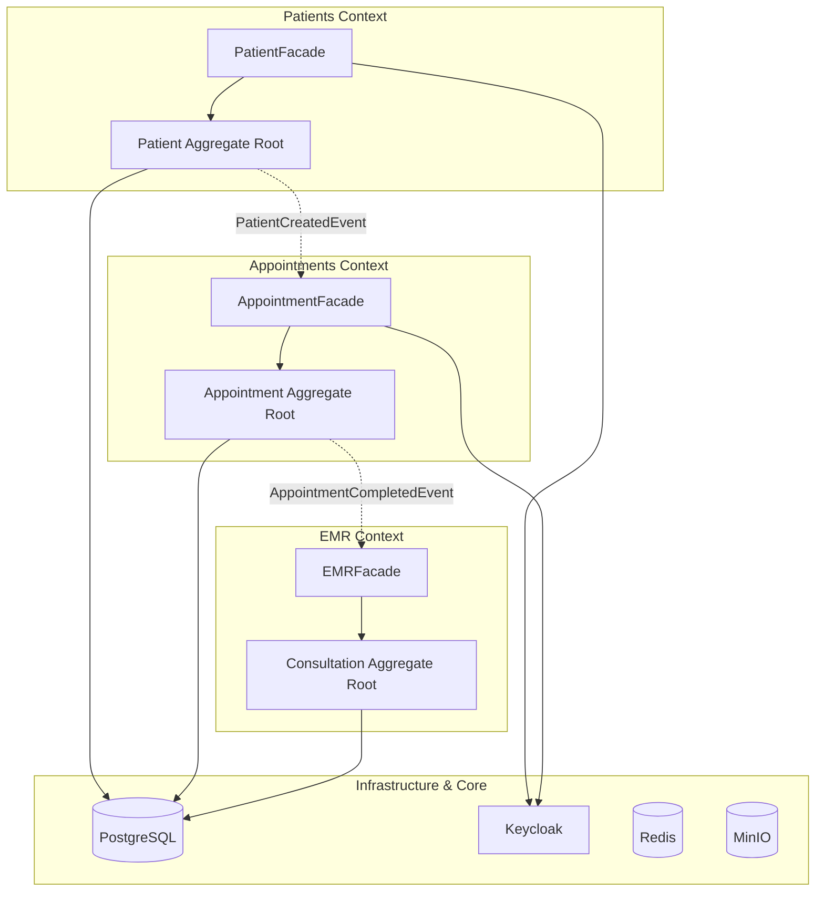

# Architecture Overview

## Bounded Contexts Diagram

```mermaid
graph TD
    %% Define subgraphs for each Bounded Context
    subgraph Patients [Patients Context]
        P_AR[Patient Aggregate Root]
        P_Facade[PatientFacade]
    end

    subgraph Appointments [Appointments Context]
        A_AR[Appointment Aggregate Root]
        A_Facade[AppointmentFacade]
    end

    subgraph EMR [EMR Context]
        E_AR[Consultation Aggregate Root]
        E_Facade[EMRFacade]
    end

    subgraph Core [Infrastructure & Core]
        DB[(PostgreSQL)]
        Auth[Keycloak]
        Cache[(Redis)]
        Storage[(MinIO)]
    end

    %% Internal module relationships
    P_Facade --> P_AR
    A_Facade --> A_AR
    E_Facade --> E_AR

    %% Inter-module async events (Domain Events)
    P_AR -.->|PatientCreatedEvent| A_Facade
    A_AR -.->|AppointmentCompletedEvent| E_Facade

    %% External Infrastructure dependencies
    P_AR --> DB
    A_AR --> DB
    E_AR --> DB
    P_Facade --> Auth
    A_Facade --> Auth
```
